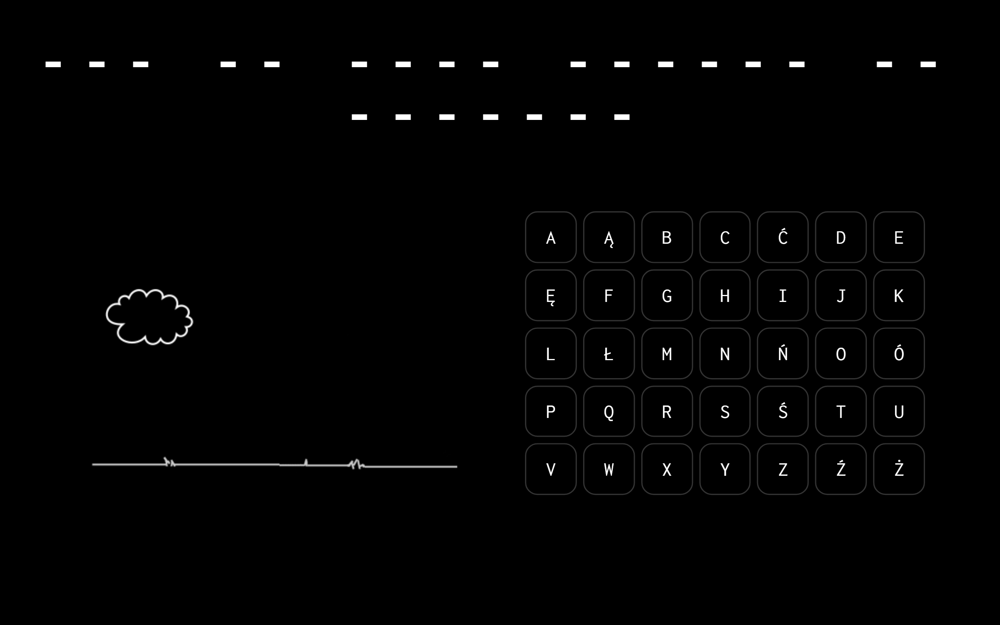
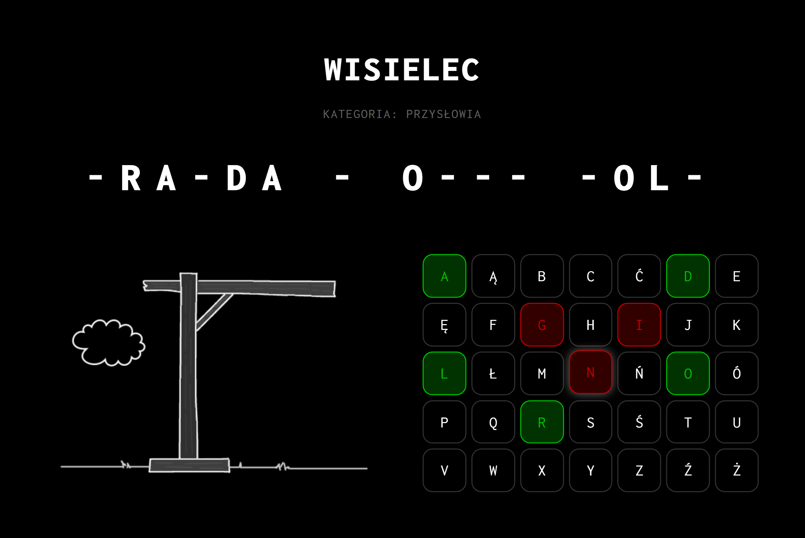
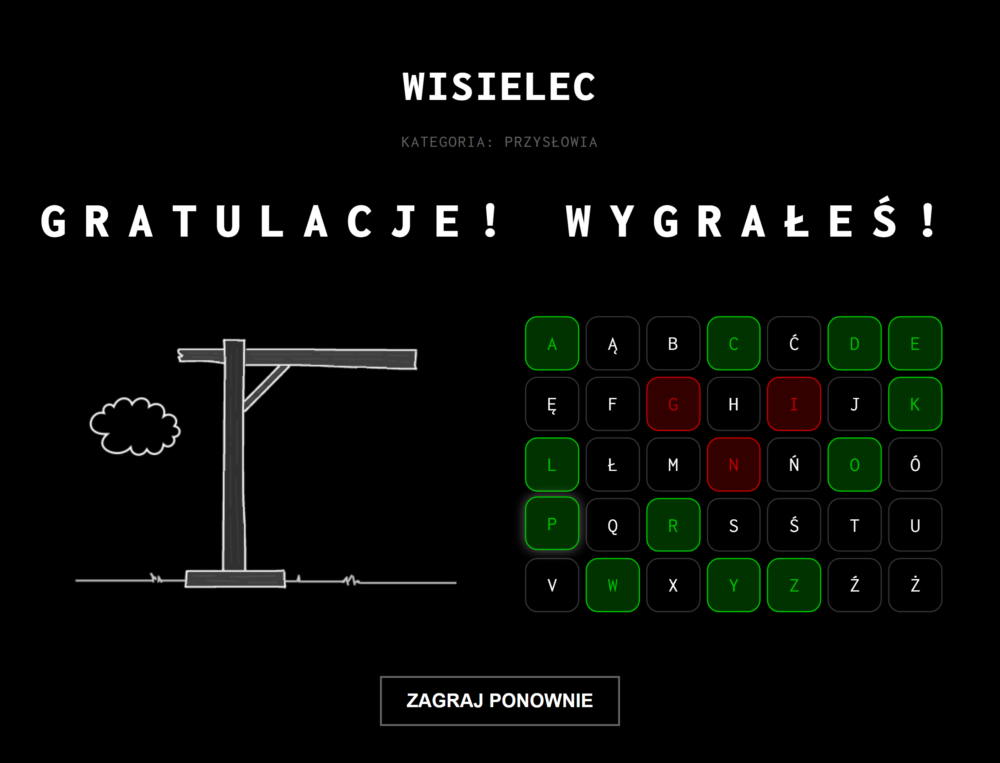
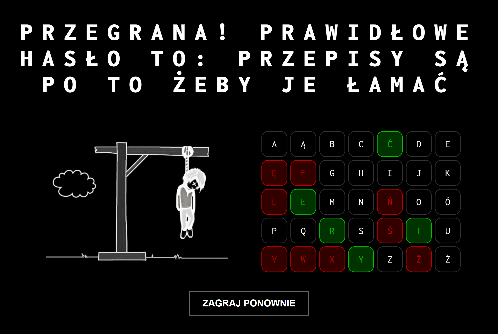

# 🎮 Modern Hangman Game (Szubienica)

👉 [Live Demo](https://jusnow1608.github.io/hanging-tree-game-javascript/)

A modern, responsive, and elegant web-based Hangman game built with clean **JavaScript (ES6+)** and **CSS (Flexbox & Grid)**. The project is inspired by classic coding tutorials but completely re-engineered using modern web development standards.

---

## 🗺️ Table of Contents
- [📸 Screenshots](#-screenshots)
- [✨ Features](#-features)
- [🛠️ Technologies Used](#️-technologies-used)
- [📁 Project Structure](#-project-structure)
- [🚀 How to Run Locally](#-how-to-run-locally)
- [⚙️ Game Rules](#️-game-rules)
- [📜 License](#-license)

---

## 📸 Screenshots

### Main Gameplay


### Match in Progress (Active State)


### Game Over States

#### Victory
 

#### Game Over


---

## ✨ Features

- **Dynamic Keyboard Generation:** The full 35-letter Polish alphabet is generated automatically via JavaScript using `document.createElement` and the spread operator.
- **100 Proverb Database:** Fully integrated array of 100 authentic Polish proverbs and sayings with native diacritics (*ą, ć, ę, ł, ń, ó, ś, ź, ż*).
- **True Randomization:** A new phrase is randomly selected from the pool upon initial load and every time the reset button is clicked.
- **Modern State Management:** Game resets completely in the browser DOM without forcing a full page reload (`location.reload()`).
- **Clean Code Architecture:** Strict separation of concerns. JavaScript handles game logic and adds descriptive CSS classes (`.correct`, `.wrong`), while CSS controls all visual styles.
- **No Pixels (Fluid Design):** Built entirely without `px` units. Uses `rem`, percentages, and fluid typography via `clamp()` for perfect scalability on any device.
- **Audio Feedback:** Immersive sound effects for correct guesses and mistakes.

---

## 🛠️ Technologies Used

- **HTML5** (Semantic structure)
- **CSS3** - CSS Grid & Flexbox
  - CSS Custom Variables (Themes)
  - Fluid typography (`clamp()`, `aspect-ratio`)
  - No-pixel policy (`rem` based)
- **JavaScript (ES6+)**
  - Array methods (`.map()`, `.forEach()`, `Array.from()`)
  - Arrow functions & Ternary operators
  - DOM Manipulation & Event Listeners
  - HTML5 Audio API

---

## 📁 Project Structure

```text
├── index.html          # Game layout and containers
├── style.css           # Scalable and responsive styles
├── index.js            # Main game logic, state management, and 100-word pool
├── yes.wav             # Sound effect for correct guess
├── no.wav              # Sound effect for incorrect guess
└── img/
    ├── s0.jpg          # Initial gallows state
    ├── s1.jpg          # Mistake 1
    ...
    └── s9.jpg          # Full gallows (Game Over state)

```
---

## ⚙️ Game Rules
The game draws a random Polish proverb and hides letters behind dashes (-), keeping spaces intact.

Click on the letters on the virtual keyboard to guess.

Correct guess: The letter turns green, plays a success sound, and reveals its positions in the password.

Incorrect guess: The letter turns red, plays a failure sound, and advances the gallows drawing by one stage.

You have a maximum of 9 incorrect guesses before the game is lost.

Click "ZAGRAJ PONOWNIE" (Play Again) to wipe the board, draw a fresh password, and start a new round instantly!

---

## 📜 License
This project is open-source and available under the MIT License.